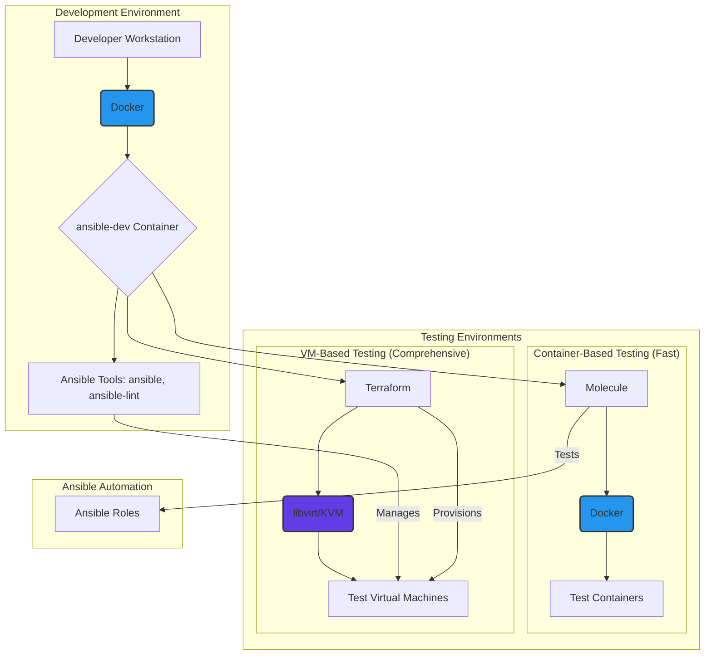
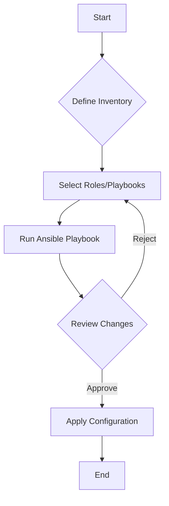

# Gnome Network Ansible

## Overview

This is the Gnome Network Ansible project designed to automate the configuration, management, and deployment of systems within the Gnome Network infrastructure. It leverages Ansible for orchestration, providing a centralized and repeatable way to maintain system state.

## Project Goals

- **Automate System Configuration:** Reduce manual intervention for setting up and configuring new and existing systems.
- **Ensure Consistency:** Maintain a consistent state across all managed hosts.
- **Simplify Deployments:** Streamline the process of deploying applications and services.
- **Improve Reliability:** Standardize configurations to minimize errors and improve system uptime.
- **Enable Scalability:** Easily manage a growing number of systems and services.

## Development and Testing Architecture

This project uses a combination of Docker, Terraform, and Molecule to provide a flexible and robust environment for developing and testing the Ansible roles. The following diagram illustrates how these components work together:



-   **Development Environment:** All development and execution of Ansible is done within a Docker container (`ansible-dev`). This ensures a consistent environment with all necessary tools, regardless of the developer's host OS.
-   **Testing:**
    -   **Molecule** is used for rapid, container-based testing of most roles. It's ideal for verifying configuration changes, package installations, and service management.
    -   **Terraform with libvirt/KVM** is used for testing roles that require full system virtualization, such as the `arch-iso-install` role, which performs disk partitioning and bootloader installation.
-   **Ansible Roles:** The roles contain the core automation logic and are tested against both container and VM environments to ensure they are robust and reliable.

## Repository Structure

This repository follows a standard Ansible project structure. The following diagram illustrates the general workflow:



The project structure is as follows:

- **`deploy.yml`**: The main Ansible playbook for deploying configurations to hosts.
- **`inventories/`**: Contains inventory files that define the hosts and groups managed by Ansible.
    - **`inventories/homelab/`**: Example inventory for a homelab setup.
    - **`inventories/workstations/`**: Example inventory for workstation setups.
        - **`hosts.yml`**: Defines the hosts within this inventory.
        - **`group_vars/`**: Contains variables applicable to specific groups of hosts.
- **`roles/`**: Contains Ansible roles, which are reusable units of automation.
    - **`roles/ansible-ctrl.init/`**: Role to initialize the Ansible controller environment.
    - **`roles/arch-iso-install/`**: Role to automate Arch Linux installation from an ISO.
    - **`roles/network/`**: Role for managing network configurations.
        - **`molecule/`**: Contains Molecule test scenarios for the network role.
    - **`roles/role.template/`**: A template directory for creating new roles, ensuring consistency in structure and documentation.
- **`terraform/`**: Infrastructure as Code for creating test VMs using Terraform and libvirt.
    - Provides VM environments for testing roles that require full system access
    - Includes helper scripts for VM creation and management
    - Enables graphical access to VMs via virt-viewer or virt-manager
- **`README.md`**: This file, providing an overview and instructions for the project.
- **`AGENTS.md`**: Provides guidelines for AI agents working with this repository.
- **`.github/`**: Contains GitHub specific files, such as workflows.
    - **`workflows/`**: Houses CI/CD workflows.
        - **`ansible-lint.yml`**: GitHub Actions workflow to automatically lint Ansible code.
        - **`molecule-test.yml`**: GitHub Actions workflow to run Molecule tests for roles.
- **`requirements.txt`**: Python dependencies for Ansible, Molecule, and testing tools.
- **`LICENSE`**: Project license information.
- **`.gitignore`**: Specifies intentionally untracked files that Git should ignore.

# Installation

## Pre-requisites

To work with this project, you will need [Docker](https://www.docker.com/) installed. Modern Docker installations include `docker compose` (note the space, not a hyphen), which is used by this project.

## Local Development Environment using Docker

This project includes a Dockerized environment to provide a consistent and isolated space for Ansible development and execution. It simplifies setup and ensures all contributors use the same versions of Ansible and related tools.

### Setup and Usage

1.  **Build the Docker Image:**
    > **Note on Docker Rate Limits:** If you encounter an error like `429 Too Many Requests`, you may have reached Docker Hub's pull rate limit for unauthenticated users. To resolve this, log in to your Docker account by running `docker login` in your terminal and then try the build command again.

    Open your terminal in the root of this project and run:
    ```bash
    sudo -E docker compose build
    sudo -E docker compose up -d
    ```
    
    **Option B: Add your user to the docker group (recommended, no sudo needed)**
    ```bash
    sudo usermod -aG docker $USER
    # Log out and back in for group changes to take effect
    docker compose build
    docker compose up -d
    ```
    
    The `-E` flag is important because it preserves your `$HOME` environment variable, which is needed to mount your SSH keys from `~/.ssh`.

2.  **Build the Docker Image:**
    ```bash
    sudo -E docker compose build
    # OR if you added yourself to docker group:
    docker compose build
    ```
    This command builds the Docker image based on the `Dockerfile`. You only need to run this initially or when the `Dockerfile` changes. Adding `--no-cache` is recommended if you suspect caching issues or want a fresh build.

3.  **Start the Development Container:**
    ```bash
    sudo -E docker compose up -d
    # OR if you added yourself to docker group:
    docker compose up -d
    ```
    Your project directory is mounted into `/data` inside the container.

4.  **Accessing the Container Shell:**
    ```bash
    sudo -E docker compose exec ansible-dev bash
    # OR if you added yourself to docker group:
    docker compose exec ansible-dev bash
    ```
    You can also use `fish` if you prefer:
    ```bash
    sudo -E docker compose exec ansible-dev fish
    ```

5.  **Running Ansible Commands:**
    Once inside the container's shell, you can run Ansible commands as usual. The working directory will be `/data`, which is your project root.
    ```bash
    # Example: Lint a playbook
    ansible-lint deploy.yml

    # Example: Run a playbook (ensure your inventory is set up and SSH_PASSWORD etc. are exported if needed)
    # export SSH_PASSWORD="your_ssh_password"
    ansible-playbook -i inventories/workstations/hosts.yml deploy.yml
    ```
    Alternatively, you can run commands directly without entering the shell:
    ```bash
    sudo docker compose exec ansible-dev ansible-lint deploy.yml

    # Note: The following command will fail with an "UNREACHABLE" error unless you have a
    # running host that matches the `arch-test-1.gnome.network` entry in the example inventory.
    # This is expected. The command is provided as a valid execution example.
    sudo docker compose exec ansible-dev ansible-playbook -i inventories/workstations/hosts.yml deploy.yml
    ```

6.  **Volume Mounts:**
    The `docker-compose.yml` file configures the following important volume mounts:
    *   `.:/data`: Your entire project directory is mapped to `/data` in the container. Changes made locally are reflected inside the container, and vice-versa.
    *   `${HOME}/.ssh/git_on3iropolos_ed25519.pub:/root/.ssh/user_public_key.pub:ro`: Only your SSH **public key** is mounted (not the entire `.ssh` directory). This provides the minimum necessary access for the `arch_iso_install` role to copy your public key to new systems, while maintaining security.
    *   `~/.gitconfig:/root/.gitconfig:ro`: Your local Git configuration is mounted read-only.
    
    **Security Note:** We mount only the specific public key file needed, not the entire `.ssh` directory. This prevents:
    - Permission conflicts with sensitive files like SSH config
    - Exposure of private keys to the container
    - Potential security issues from mounting files with different ownership
    
    **Customization:** If you need to use a different public key, update the volume mount in `docker-compose.yml` and the `pub_key_location` in your host_vars file.

7.  **Internet Connectivity Check:**
    Playbooks that include roles known to require internet access (like `arch-iso-install` or `network` for package installation) have a pre-flight check. This check attempts to connect to `google.com`. If it fails, the playbook will halt before running internet-dependent tasks. This is to ensure a better experience when working offline or with intermittent connectivity.

8.  **Stopping the Container:**
    ```bash
    sudo -E docker compose down
    # OR if you added yourself to docker group:
    docker compose down
    ```
    If you just want to stop it without removing it (so it starts faster next time):
    ```bash
    sudo -E docker compose stop
    ```

### Offline Usage
Once the Docker image is built (`docker compose build`), the Ansible tools (Ansible, Ansible Lint, Git, etc.) are installed within the image. This means you can use these tools inside the container to work on your playbooks (e.g., editing, linting, running playbooks against locally accessible hosts or VMs) without an active internet connection.

However, any Ansible tasks that inherently require internet access (e.g., downloading packages with `apt`/`yum`/`pacman`, cloning git repositories from the internet, using `uri` to fetch remote files) will naturally fail if the container cannot access the internet. The pre-flight internet check mentioned above aims to catch this early for known roles.

## Running Playbooks

### 1. Prepare Target Hosts

For Arch ISO installations or VM testing, see role-specific documentation:
- **Arch ISO installations:** See [`roles/arch_iso_install/README.md`](roles/arch_iso_install/README.md#testing)
- **VM-based testing:** See [`terraform/README.md`](terraform/README.md)

For existing systems, ensure SSH access is configured.

### 2. Configure Inventory

Update your inventory file (e.g., [`inventories/workstations/hosts.yml`](inventories/workstations/hosts.yml)) with:
- Host IP addresses or hostnames
- Connection parameters (user, SSH settings)
- Group and host variables as needed

### 3. Set Required Environment Variables

Create a `.env` file in the project root directory:

```bash
cp .env.example .env
```

Then edit `.env` and set your actual passwords:

```bash
# .env file
SSH_PASSWORD=your_actual_ssh_password
ENCRYPTION_PASSWORD=your_actual_encryption_password
USER_PASSWORD=your_actual_user_password
```

**Important Notes:**
- The `.env` file is automatically ignored by git (it's in `.gitignore`)
- Docker Compose automatically reads this file when you run commands
- Never commit `.env` to version control
- Use `.env.example` as a template for others

**Alternative (Not Recommended):** You can also export environment variables, but this requires not using `sudo`:
```bash
export SSH_PASSWORD="your_ssh_password"
export ENCRYPTION_PASSWORD="your_encryption_password"
export USER_PASSWORD="your_user_password"
# Then run without sudo or use sudo -E
docker compose exec ansible-dev ansible-playbook ...
```

### 4. Execute Playbook

```bash
# From within the Docker container or local environment
ansible-playbook -i inventories/workstations/hosts.yml deploy.yml

# Or use tags for specific roles
ansible-playbook -i inventories/workstations/hosts.yml deploy.yml --tags network
```

# Contributing Guidelines

We welcome contributions to improve and expand this Ansible project! To ensure a smooth collaboration process, please follow these guidelines:

## Proposing Changes

- **Issues First:** For significant changes or new features, please open an issue first to discuss the proposed changes and ensure they align with the project goals.
- **Pull Requests:** Submit changes via pull requests (PRs) from your fork or a feature branch.
- **Clear Descriptions:** Provide a clear and concise description of the changes in your PR. Link to any relevant issues.
- **Atomic Commits:** Try to make your commits atomic, focusing on a single logical change per commit. Adhere to the commit message format described below.

### Branch Naming

Create descriptive branch names to help understand the purpose of the branch. A good format is:

`<type>/<issue-id_or_short-description>`

Where `<type>` can be:
-   `feature`: For new features or enhancements.
-   `bugfix`: For fixing bugs.
-   `docs`: For documentation changes.
-   `chore`: For maintenance tasks, refactoring, etc.
-   `role`: For changes specific to an Ansible role (e.g., `role/nginx-update-template`).

Examples:
-   `feature/add-user-creation-role`
-   `bugfix/fix-network-config-typo`
-   `docs/update-contributing-guidelines`
-   `chore/refactor-inventory-scripts`

### Commit Messages (Conventional Commits)

This project follows the [Conventional Commits](https://www.conventionalcommits.org/) specification. This creates an explicit commit history, which makes it easier to track features, fixes, and breaking changes.

Each commit message consists of a **header**, a **body**, and a **footer**.

```
<type>[optional scope]: <description>

[optional body]

[optional footer]
```

-   **Type**: Must be one of the following:
    -   `feat`: A new feature.
    -   `fix`: A bug fix.
    -   `docs`: Documentation only changes.
    -   `style`: Changes that do not affect the meaning of the code (white-space, formatting, missing semi-colons, etc).
    -   `refactor`: A code change that neither fixes a bug nor adds a feature.
    -   `perf`: A code change that improves performance.
    -   `test`: Adding missing tests or correcting existing tests.
    -   `build`: Changes that affect the build system or external dependencies (example scopes: gulp, broccoli, npm).
    -   `ci`: Changes to our CI configuration files and scripts (example scopes: Travis, Circle, BrowserStack, SauceLabs).
    -   `chore`: Other changes that don't modify src or test files.
    -   `revert`: Reverts a previous commit.
-   **Scope (Optional)**: A noun describing a section of the codebase affected by the change (e.g., `ansible.cfg`, `role:nginx`, `inventory`).
-   **Description**: Succinct description of the change in present imperative tense (e.g., "Add parameter for port configuration" not "Added parameter...").
-   **Body (Optional)**: Longer description providing context or details.
-   **Footer (Optional)**: For breaking changes (use `BREAKING CHANGE: <description>`) or referencing issues (e.g., `Closes #123`).

Examples:
```
feat(role:app-deploy): add support for blue/green deployments
```
```
fix: correct typo in ansible.cfg comments
```
```
docs: explain new variable for user role

The `user_shell` variable allows specifying a custom shell for new users.
Defaults to /bin/bash.
```
```
refactor(inventory): optimize script for generating dynamic inventory

BREAKING CHANGE: The output format of the dynamic inventory script has changed.
Refer to the updated documentation for details.
Closes #42
```

### Labels for Issues and Pull Requests

Use labels to categorize issues and pull requests. This helps in filtering and managing them. Suggested labels:

-   **Type:**
    -   `type:bug`
    -   `type:enhancement`
    -   `type:documentation`
    -   `type:question`
    -   `type:chore`
    -   `type:refactor`
-   **Component/Area:**
    -   `comp:ansible.cfg`
    -   `comp:role:<role-name>` (e.g., `comp:role:nginx`)
    -   `comp:inventory`
    -   `comp:ci`
    -   `comp:docs`
-   **Status:**
    -   `status:needs-review`
    -   `status:in-progress`
    -   `status:blocked`
    -   `status:wontfix`
    -   `status:duplicate`
-   **Priority (Optional):**
    -   `priority:high`
    -   `priority:medium`
    -   `priority:low`

## Documentation

- **Role Documentation:** All new roles must include a `README.md` file within their directory, based on the `roles/role.template/README.md` template.
- **Updating Documentation:** If your changes affect existing roles, playbooks, or the overall project structure, please update the relevant documentation (including this `README.md` and any role-specific `README.md` files).
- **Inline Comments:** Use comments within playbooks and task files where necessary to clarify complex logic or non-obvious steps.

## Testing

This project implements multiple levels of testing to ensure code quality and functionality:

### Automated Linting
- **ansible-lint:** This project uses `ansible-lint` for static code analysis. An automated GitHub Actions workflow runs `ansible-lint .` on every pull request targeting the `main` branch.
- **Local Linting (Recommended):** Run `ansible-lint .` locally before pushing changes to catch issues early. Use the provided Docker environment or a local Python environment with `ansible` and `ansible-lint` installed.

### Molecule Testing (Container-Based)
- **Automated Role Testing:** Molecule with Docker provides fast, lightweight testing for most roles
- **CI/CD Integration:** Tests run automatically via GitHub Actions on pull requests
- **Test Coverage:** Includes package installation, service configuration, and idempotency verification
- **Getting Started:** See [`DEVELOPMENT.md`](DEVELOPMENT.md#testing-with-molecule--docker) for setup and detailed workflow

### VM-Based Testing (Terraform + libvirt)
- **For System-Level Roles:** Roles like `arch_iso_install` requiring disk partitioning, bootloader installation, or encryption
- **Infrastructure:** Uses KVM/libvirt VMs with graphical access for comprehensive testing
- **Getting Started:** See [`terraform/README.md`](terraform/README.md) for complete setup, usage, and troubleshooting

### Testing Best Practices
- **Choose the Right Method:**
  - Molecule + Docker: Service configuration, package management, standard system tasks
  - Terraform VMs: Installation roles, operations requiring full system access
- **Ensure Idempotency:** All roles must be idempotent (running multiple times produces no unintended changes)
- **Test Locally First:** Run tests locally before pushing changes to catch issues early

For complete testing instructions, workflows, and troubleshooting, see [`DEVELOPMENT.md`](DEVELOPMENT.md).

## Review Process


- **Request Reviews:** Once your PR is ready, request reviews from relevant team members or designated reviewers. If unsure, tag the project maintainers.
- **Address Feedback:** Respond to review comments and make necessary changes. Push updates to the same branch.
- **Approval:** Aim for at least one approval from a reviewer before merging. For significant changes, more approvals might be requested.
- **Merge:** Once approved and all checks pass, the PR can be merged by a maintainer or by the author if they have merge permissions.

# Best Practices

Adhering to these best practices will help maintain a high-quality, understandable, and maintainable codebase.

## Naming Conventions

- **Roles:** Use lowercase with hyphens for separation (e.g., `my-new-role`).
- **Playbooks:** Use lowercase with hyphens and a `pb_` prefix (e.g., `pb_deploy_webservers.yml`, `pb_configure_firewall.yml`).
- **Task Files:** If tasks are broken out into separate files (e.g., for `include_tasks`), use lowercase with hyphens and a `tasks_` prefix (e.g., `tasks_setup_users.yml`, `tasks_harden_ssh.yml`).
- **Variable Files:** For files defining variables (e.g., in `group_vars`, `host_vars`, or loaded with `vars_files`):
    - Use lowercase with underscores (e.g., `vars_common.yml`, `vars_database_settings.yml`).
    - For group/host vars, the filename should match the group/host name (e.g., `group_vars/webservers.yml`).
- **Role Variables:** Use lowercase with underscores (e.g., `my_variable_name`). Prefix role-specific variables with the role name to avoid collisions (e.g., `nginx_port`, `common_packages_to_install`).
- **Inventory Variables (group_vars/host_vars):**
    - Use lowercase with underscores.
    - Consider prefixing with a project or component name for clarity if variables might overlap or for better organization (e.g., `myproject_db_port`, `common_ntp_server`).
- **Inventory Group Names:**
    - Use lowercase with underscores.
    - Aim for descriptive names that reflect the purpose, environment, or characteristics of the group (e.g., `env_production`, `app_webservers`, `dc_primary`, `os_debian`).
- **Task Names (within playbooks/roles):** Task names should be descriptive, sentence-case (first letter capitalized), and clearly state the action being performed (e.g., "Install nginx package", "Ensure nginx service is started and enabled", "Copy application configuration file").

## Role Development

- **Idempotency:** Roles must be idempotent. Ansible tasks should describe the desired state, not just a series of commands.
- **Modularity:** Keep roles focused on a specific purpose. Avoid creating overly complex roles that try to do too many things.
- **Default Variables:** Provide sensible default values for all variables a role uses in `defaults/main.yml`.
- **Variable Clarity:** Clearly document all configurable variables in the role's `README.md`.
- **Handlers:** Use handlers for tasks that should only run when a change is made (e.g., restarting a service after a configuration file update).

## Playbook Writing

- **Clarity:** Write playbooks that are easy to read and understand.
- **Task Descriptions:** Always include a `name` for each task that clearly describes its purpose.
- **Tags:** Use tags to allow for more granular execution of playbooks (e.g., `ansible-playbook deploy.yml --tags common,nginx`).

## Secrets Management

- **Ansible Vault:** Use Ansible Vault to encrypt sensitive data like passwords, API keys, and certificates.
- **Avoid Hardcoding:** Never hardcode secrets directly into playbooks, roles, or inventory files. Store them in encrypted vault files and reference them as variables.
- **Environment Variables:** For secrets needed during playbook execution (like `SSH_PASSWORD` mentioned in the installation), prefer using environment variables that are set temporarily in the execution environment rather than storing them in version control.

## General

- **Regular Updates:** Keep Ansible and its collections/roles updated to the latest stable versions to benefit from security patches and new features.
- **Version Control:** Commit frequently with clear, descriptive messages.
