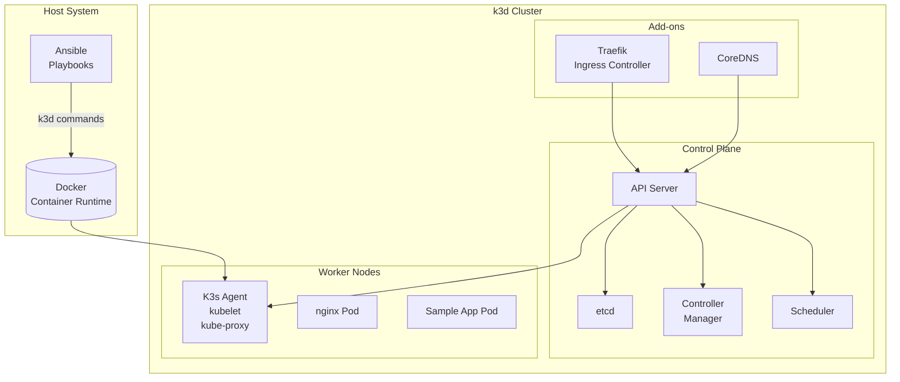
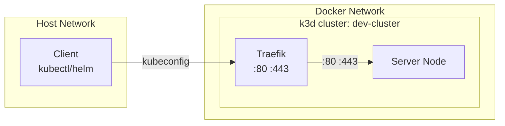

# Kubernetes Cluster Architecture

This document describes the architecture of the local Kubernetes cluster provisioned using k3d.

## Overview



## Components

### Control Plane (Server Node)

| Component | Description | Image |
|-----------|-------------|-------|
| **kube-apiserver** | REST API for Kubernetes | k3s |
| **etcd** | Distributed key-value store | k3s |
| **kube-scheduler** | Assigns pods to nodes | k3s |
| **kube-controller-manager** | Runs controller loops | k3s |

### Worker Nodes (Agent Nodes)

| Component | Description |
|-----------|-------------|
| **kubelet** | Agent that manages containers on the node |
| **kube-proxy** | Network proxy for service connectivity |
| **containerd** | Container runtime (embedded in k3s) |

### Add-ons

| Add-on | Purpose |
|--------|---------|
| **Traefik** | Ingress controller for HTTP/HTTPS routing |
| **CoreDNS** | DNS-based service discovery |
| **Metrics Server** | Resource metrics collection |

## Network Architecture



### Port Mappings

| Host Port | Service | Description |
|-----------|---------|-------------|
| 80 | Traefik | HTTP ingress |
| 443 | Traefik | HTTPS ingress |
| 6443 | API Server | Kubernetes API (internal) |

## Storage

### Ephemeral Storage
- Default: Container images and layers stored in Docker's storage driver
- Suitable for development and testing

### Persistent Storage
- Requires CSI driver configuration
- For production workloads, configure:
  - Local PV (HostPath)
  - NFS
  - Cloud provider CSI

## Security Considerations

### Network Policies
- Default: All pods can communicate
- Restrict with NetworkPolicy resources

### RBAC
- Default: Cluster-admin for local development
- Production: Implement Role/RoleBinding

### Secrets
- Default: Stored as base64 (not encrypted)
- Production: Use external secrets manager

## High Availability (Optional)

For production-like environments, scale the cluster:

```yaml
k3d_server_nodes: 3    # Multiple control plane nodes
k3d_worker_nodes: 2   # Worker nodes for workloads
```

## Related Documentation

- [Quickstart Guide](quickstart.md) - Setup instructions
- [Sample Application](sample-app.md) - Deployment walkthrough
- [Operations](operations.md) - Common operations
