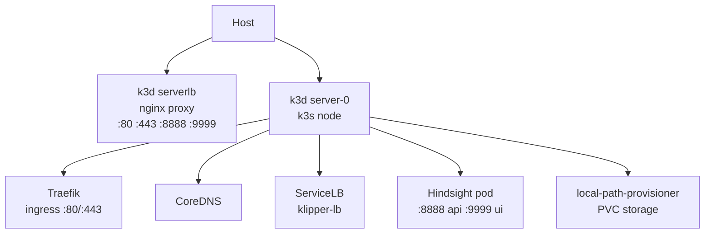

# Kubernetes Reference

## Architecture



## Hindsight Resources

| Resource | Details |
|----------|---------|
| Namespace | `hindsight` |
| Secret | `hindsight-env` (from `.env`) |
| PVC | `hindsight-data` (10Gi, local-path) |
| Deployment | `hindsight` (1 replica, 500m–2000m CPU, 1Gi–4Gi RAM) |
| Service | LoadBalancer (8888→api, 9999→control-plane) |

## Key Commands

```bash
# Cluster
k3d cluster list
k3d cluster stop/start/delete dev-cluster

# Hindsight
kubectl get pods -n hindsight
kubectl logs -f deployment/hindsight -n hindsight
kubectl scale deployment/hindsight --replicas=0 -n hindsight

# Debug
kubectl describe pod -n hindsight <pod>
kubectl get events -A --sort-by='.lastTimestamp'
```
