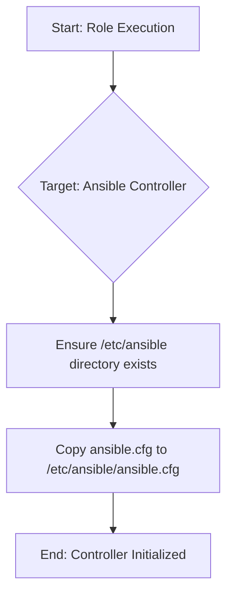

# Role Name: `ansible-ctrl.init`

## Description

This role initializes the Ansible controller itself. It ensures that the necessary directory structure (e.g., `/etc/ansible`) exists and copies the base `ansible.cfg` file into place. This role is intended to be run on the Ansible controller node, typically within the Docker container defined by `ansible-ctrl.dockerfile`.

The initialization process is as follows:



## Requirements

-   Ansible version: `2.9+` (or as per `ansible-ctrl.dockerfile`)
-   Operating System: The base image of the ansible-dev container (currently `alpine:latest` with custom glibc).
-   Permissions: Requires `become: true` to create directories and copy files to system locations like `/etc/ansible`.

## Role Variables

This role does not use any configurable variables from `defaults/main.yml`.

## Dependencies

None.

## Example Playbook

This role is typically run directly on `localhost` (the controller) if needed as part of a larger setup, or implicitly when the controller starts if it's part of the image build or entrypoint.

```yaml
- hosts: localhost
  become: true
  roles:
    - role: ansible-ctrl.init
```

Or, as commented out in the main `deploy.yml`:
```yaml
# - hosts: localhost
#   become: true
#   roles:
#     - ansible-ctrl.init
```

## License

See LICENSE file in the root of the repository.

## Author Information

Gnome Network Ansible project
```
