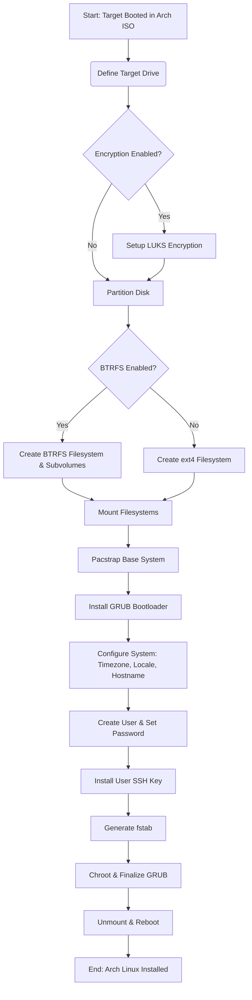

# Role Name: `arch-iso-install`

## Description

This role automates the installation of Arch Linux on a target machine that has been booted from the Arch Linux installation media. It is designed to set up a fully functional system including disk partitioning, optional encryption, filesystem creation (BTRFS or ext4), bootloader installation (GRUB), and basic system configuration like timezone and user creation.

Key features:
-   Automated partitioning of the target drive.
-   Optional LUKS encryption for the root partition.
-   Support for BTRFS filesystem with subvolumes, or standard ext4.
-   GRUB bootloader installation.
-   User creation with password and SSH public key.
-   System localization (timezone, hostname).

Special thanks to the following repositories for inspiration:
-   [33Fraise33/desktop-ansible](https://github.com/33Fraise33/desktop-ansible/tree/main)
-   [jsf9k/ansible-arch-install](https://github.com/jsf9k/ansible-arch-install)

The overall installation flow is as follows:



## Requirements

-   Ansible version: `2.9+` (or as per `ansible-ctrl.dockerfile`)
-   Target Host: Must be booted into the Arch Linux installation environment.
-   SSH Access: SSH server must be running on the target Arch ISO environment, and accessible by Ansible (typically as the `root` user initially).
-   Environment Variables: Certain sensitive variables (passwords) are expected to be set as environment variables on the Ansible controller (see `defaults/main.yml` and "Role Variables" section).
-   Internet Access: Required on the target host to download packages during the Arch Linux installation.

## Role Variables

Variables are defined in `defaults/main.yml`. Sensitive values like passwords should be supplied via environment variables on the Ansible controller.

| Variable                      | Default Value                                  | Description                                                                                                |
| ----------------------------- | ---------------------------------------------- | ---------------------------------------------------------------------------------------------------------- |
| `install_drive`               | `/dev/sda`                                     | The target disk device for Arch Linux installation (e.g., `/dev/vda`, `/dev/nvme0n1`). **Verify this carefully!** |
| `encryption.enabled`          | `true`                                         | Enables LUKS encryption for the root partition.                                                            |
| `encryption.password`         | `"{{ lookup('env', 'ENCRYPTION_PASSWORD') }}"` | The password for LUKS encryption. **Must be set as an environment variable `ENCRYPTION_PASSWORD`**.         |
| `btrfs.enabled`               | `true`                                         | If `true`, uses BTRFS for the root filesystem. If `false`, ext4 will be used.                               |
| `btrfs.subvols`               | (See `defaults/main.yml`)                      | A list of BTRFS subvolumes to create. Each item is a dictionary with `sub`, `path`, and optional `disable_cow`. |
| `timezone`                    | `America/Chicago`                              | The system timezone to set (e.g., `Europe/London`, `UTC`).                                                   |
| `user.name`                   | `on3ir`                                        | The username for the primary user to be created.                                                           |
| `user.password`               | `"{{ lookup('env', 'USER_PASSWORD') }}"`       | The password for the primary user. **Must be set as an environment variable `USER_PASSWORD`**.             |
| `user.full`                   | `on3iropolos`                                  | The full name (GECOS) for the primary user.                                                                |
| `user.email`                  | `on3iropolos@gmail.com`                        | The email address for the primary user (used for git config, etc.).                                        |
| `user.pub_key_location`       | `/root/.ssh/on3iropolos-ssh.pub`               | Path on the Ansible controller to the user's public SSH key, to be installed for the new user on the target. |
| `bootloader`                  | `grub`                                         | The bootloader to install. Currently, only GRUB is supported.                                              |
| `boot_esp`                    | `/boot/efi`                                    | The mount point for the EFI System Partition (ESP).                                                        |

*(For the structure of `btrfs.subvols`, refer to `roles/arch-iso-install/defaults/main.yml`.)*

## Dependencies

None. This role is self-contained for the installation process.

## Example Playbook

This role is typically run against a host that is booted into the Arch Linux installation media. The `ansible_user` is usually `root` for the installation process.

```yaml
- hosts: archiso_target_host  # A host defined in your inventory, booted into Arch ISO
  become: true
  ansible_user: root          # Or the user accessible in the Arch ISO environment
  environment:                # Ensure these are set on the controller
    ENCRYPTION_PASSWORD: "your_strong_encryption_password"
    USER_PASSWORD: "your_strong_user_password"
  roles:
    - role: arch-iso-install
      vars:
        install_drive: /dev/vda  # Example: Overriding the default install drive
        user.name: "newadmin"
        user.pub_key_location: "/path/to/newadmin.pub" # Path on Ansible controller
        timezone: "Europe/Berlin"
```

**Important:** Ensure environment variables `ENCRYPTION_PASSWORD` and `USER_PASSWORD` are set in the shell where you run `ansible-playbook`, or through other secure means like Ansible Tower/AWX credentials.

## Testing

This role requires VM-based testing using the project's Terraform infrastructure. See [`../../terraform/README.md`](../../terraform/README.md) for VM setup instructions and [`../../README.md#running-playbooks`](../../README.md#running-playbooks) for environment variable configuration.

### Test Scenarios

#### Scenario 1: Basic Installation (No Encryption, ext4)

**Variables:**
```yaml
encryption:
  enabled: false
btrfs:
  enabled: false
```

**Expected Results:**
- System installs to ext4 filesystem
- No encryption prompts on boot
- GRUB boots directly to system
- User can login

#### Scenario 2: Encrypted Installation with BTRFS (Default)

**Variables:**
```yaml
encryption:
  enabled: true
btrfs:
  enabled: true
```

**Expected Results:**
- LUKS encryption prompt on boot
- BTRFS subvolumes mounted correctly
- System boots after entering password
- All subvolumes visible with `btrfs subvolume list /`

#### Scenario 3: Custom Configuration

Test with custom values:
```yaml
timezone: "Europe/London"
user:
  name: "testuser"
  full: "Test User"
install_drive: "/dev/vdb"  # Second disk in Terraform VM
```

### Manual Testing Checklist

#### Pre-Installation
- [ ] VM boots from Arch ISO
- [ ] Network connectivity works
- [ ] SSH access established
- [ ] Environment variables set correctly

#### During Installation
- [ ] Disk partitioning succeeds
- [ ] Encryption setup (if enabled) succeeds
- [ ] Filesystem creation succeeds
- [ ] Pacstrap installs base system
- [ ] GRUB installation succeeds
- [ ] System configuration applied (timezone, locale, hostname)
- [ ] User creation succeeds
- [ ] SSH key installation succeeds

#### Post-Installation
- [ ] System reboots successfully
- [ ] GRUB menu appears
- [ ] Encryption password prompt (if enabled)
- [ ] System boots to login
- [ ] User can login with password
- [ ] User can login with SSH key
- [ ] System timezone is correct
- [ ] Hostname is set correctly
- [ ] Network connectivity works

#### BTRFS Specific (if enabled)
- [ ] All subvolumes created
- [ ] Subvolumes mounted at correct paths
- [ ] CoW disabled for appropriate subvolumes
- [ ] `btrfs filesystem show` displays correctly

### Troubleshooting

**Role Fails at Partitioning:**
- Check: Correct disk device in variables (`install_drive`)
- Verify: Disk is not already partitioned/formatted
- Solution: Use a fresh VM or wipe disk manually

**Role Fails at Encryption:**
- Check: `ENCRYPTION_PASSWORD` environment variable is set
- Verify: Password meets requirements (non-empty)
- Solution: Set environment variable before running playbook

**Role Fails at GRUB Installation:**
- Check: EFI partition created correctly
- Verify: System booted in UEFI mode
- Solution: Ensure VM uses UEFI (Terraform config handles this)

**System Won't Boot After Installation:**
- Check: GRUB installed to correct disk
- Verify: Boot order in VM settings
- Solution: In virt-manager, check boot device order

**SSH Key Authentication Not Working:**
- Check: `user.pub_key_location` points to valid public key
- Verify: Public key file exists on Ansible controller
- Solution: Create SSH key pair if needed: `ssh-keygen -t ed25519`

### Testing Best Practices

1. **Test Encryption Scenarios**: Always test both encrypted and non-encrypted installations
2. **Verify BTRFS Subvolumes**: When using BTRFS, check all subvolumes are created and mounted correctly
3. **Test Custom Variables**: Validate custom timezone, username, and disk device configurations
4. **Document Variable Combinations**: Note which role variable combinations have been tested
5. **Preserve Test Logs**: Save Ansible output for failed installations to identify role issues

## License

See the `LICENSE` file within this role's directory (`roles/arch-iso-install/LICENSE`).

## Author Information

Gnome Network Ansible project (adapted from original sources)
```
