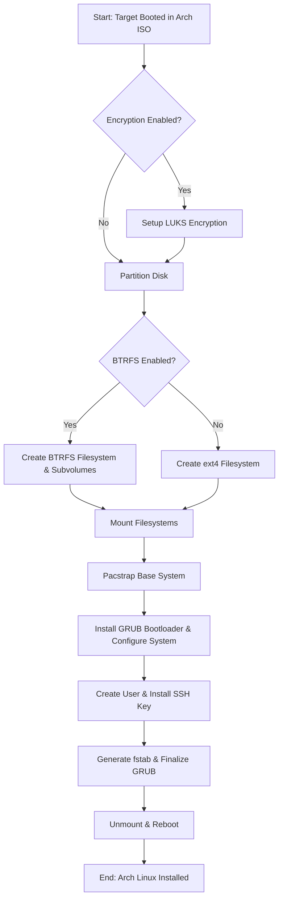

# Role Name: `arch_iso_install`

## Description

This role automates the installation of Arch Linux on a target machine that has been booted from the official Arch Linux installation media. It handles disk partitioning, optional LUKS encryption, filesystem creation (BTRFS or ext4), bootloader installation, and basic system configuration.

The installation process is as follows:



## Requirements

-   **Ansible version:** `2.9+`
-   **Target Host:** A machine booted into the Arch Linux installation environment with a running SSH server.
-   **Internet Access:** Required on the target host to download packages.
-   **Environment Variables:** Passwords for encryption and user accounts must be set as environment variables on the Ansible controller.

## Role Variables

The most critical variables are listed below. For a complete list and their default values, see `defaults/main.yml`.

| Variable                | Default Value                                  | Description                                                                                         |
| ----------------------- | ---------------------------------------------- | --------------------------------------------------------------------------------------------------- |
| `install_drive`         | `/dev/sda`                                     | The target disk device for installation (e.g., `/dev/vda`). **Verify this carefully!**                  |
| `encryption.enabled`    | `true`                                         | Enables LUKS encryption for the root partition.                                                     |
| `encryption.password`   | `"{{ lookup('env', 'ENCRYPTION_PASSWORD') }}"` | Encryption password. **MUST be set as `ENCRYPTION_PASSWORD` environment variable.**                 |
| `btrfs.enabled`         | `true`                                         | Use BTRFS for the root filesystem. If `false`, ext4 is used.                                        |
| `timezone`              | `America/Chicago`                              | The system timezone to set.                                                                         |
| `user.name`             | `on3ir`                                        | The username for the primary user.                                                                  |
| `user.password`         | `"{{ lookup('env', 'USER_PASSWORD') }}"`       | User password. **MUST be set as `USER_PASSWORD` environment variable.**                             |
| `user.pub_key_location` | `/root/.ssh/on3iropolos-ssh.pub`               | Path on the Ansible controller to the user's public SSH key.                                        |

## Dependencies

None.

## Example Playbook

This role must be run against a host booted into the Arch Linux installation media, typically as the `root` user.

```yaml
- hosts: arch_install_target
  become: true
  ansible_user: root
  environment:
    ENCRYPTION_PASSWORD: "your_luks_password"
    USER_PASSWORD: "your_user_password"
  roles:
    - role: arch-iso-install
      vars:
        install_drive: /dev/vda
        timezone: "Europe/Berlin"
        user.name: "admin"
```

## Testing

This role requires a virtual machine environment for testing. Refer to the main `DEVELOPMENT.md` for detailed instructions on setting up the Terraform/libvirt test environment and running the installation.

## License

See LICENSE file in the root of the repository.

## Author Information

Gnome Network Ansible project
