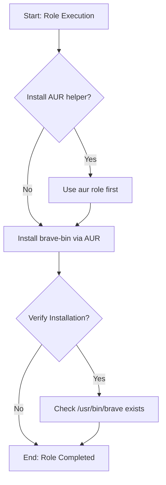

# Role: `brave`

## Description

Installs Brave Browser from the Arch User Repository (AUR).



## Requirements

- Arch Linux
- AUR helper (paru - installed by `aur` role)

## Role Variables

| Variable | Default Value | Description |
| -------- | ------------- | ----------- |
| `verify_enabled` | `true` | Run verification tasks |

## Dependencies

- `aur` role - provides AUR build environment with `aur_builder` user

## Example Playbook

```yaml
- hosts: workstations
  become: true
  roles:
    - role: aur
    - role: brave
```

## License

See LICENSE file in the root of the repository.