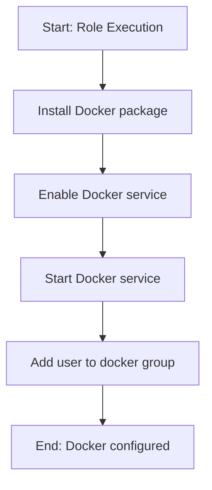

# Role Name: `docker`

## Description

This role installs and configures Docker on the target host. It installs the Docker package, enables and starts the Docker service, and adds the current user to the docker group for seamless container management without sudo.



## Requirements

- Ansible version: `2.9+`
- Operating System: Arch Linux
- Software: None (Docker is available in Arch repos)

## Role Variables

| Variable | Default Value | Description |
|----------|---------------|-------------|
| `verify_enabled` | `true` | Enable verification tasks |

## Dependencies

None.

## Example Playbook

```yaml
- hosts: localhost
  become: true
  roles:
    - role: docker
```

## License

See LICENSE file in the root of the repository.

## Author Information

Gnome Network Ansible project
