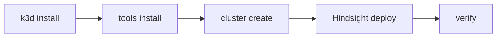

# kubernetes

Sets up a local k3d cluster and deploys the Hindsight memory service.



## Requirements

- Arch Linux, Docker running, Ansible 2.9+
- `.env` file at project root with `HINDSIGHT_API_LLM_API_KEY`

## Role Variables

| Variable | Default | Description |
|----------|---------|-------------|
| `k3d_cluster_name` | `dev-cluster` | Cluster name |
| `k3d_server_nodes` | `1` | Server nodes |
| `k3d_worker_nodes` | `0` | Worker nodes |
| `k3d_fix_dns` | `"0"` | Set `"1"` if behind corporate VPN |
| `k3d_port_mapping` | `["80:80", "443:443", "8888:8888@loadbalancer", "9999:9999@loadbalancer"]` | Host→cluster port mappings |
| `hindsight_image` | `ghcr.io/vectorize-io/hindsight:latest` | Container image |
| `hindsight_replicas` | `1` | Replica count |
| `hindsight_env_file` | `{{ playbook_dir | default('.') }}/.env` | Path to `.env` |

See `defaults/main.yml` for all variables.

## Example

```yaml
- hosts: localhost
  become: true
  roles:
    - role: docker
    - role: kubernetes
```

Run: `ansible-playbook provision.yml`

## Further Reading

- [Getting Started](../docs/kubernetes/getting-started.md)
- [Reference](../docs/kubernetes/reference.md)
