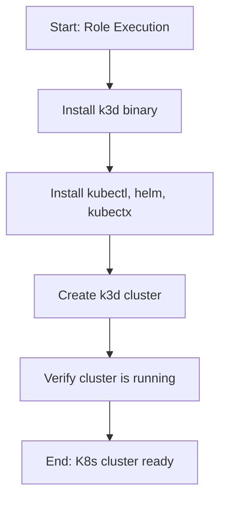

# Role Name: `kubernetes`

## Description

This role sets up a local Kubernetes development cluster using k3d (Kubernetes in Docker). It installs k3d, kubectl, helm, and kubectx, then creates a k3d cluster with configurable server and worker nodes.



## Requirements

- Ansible version: `2.9+`
- Operating System: Arch Linux
- Software: Docker must be installed and running
- Other roles: `docker`

## Role Variables

| Variable | Default Value | Description |
|----------|---------------|-------------|
| `verify_enabled` | `true` | Enable verification tasks |
| `k3d_version` | `latest` | k3d version to install |
| `k3d_cluster_name` | `dev-cluster` | Name of the k3d cluster |
| `k3d_server_nodes` | `1` | Number of server nodes |
| `k3d_worker_nodes` | `0` | Number of worker nodes |
| `k3d_k3s_version` | `""` | Optional k3s version to pin |
| `k3d_port_mapping` | `["80:80", "443:443"]` | Port mappings for ingress |

## Dependencies

- `docker` - Docker must be installed first

## Further Documentation

For full Kubernetes portfolio documentation including architecture, quickstart guides, and operational playbooks, see:

- [Kubernetes Documentation](../docs/k8s/README.md)
- [Sample Application Guide](../docs/k8s/sample-app.md)
- [Operations Guide](../docs/k8s/operations.md)

## Example Playbook

```yaml
- hosts: localhost
  become: true
  roles:
    - role: docker
    - role: kubernetes
      vars:
        k3d_cluster_name: "my-cluster"
        k3d_server_nodes: 3
        k3d_worker_nodes: 2
```

Or use the provided playbook:

```bash
ansible-playbook k8s.yml
```

## License

See LICENSE file in the root of the repository.

## Author Information

Gnome Network Ansible project
