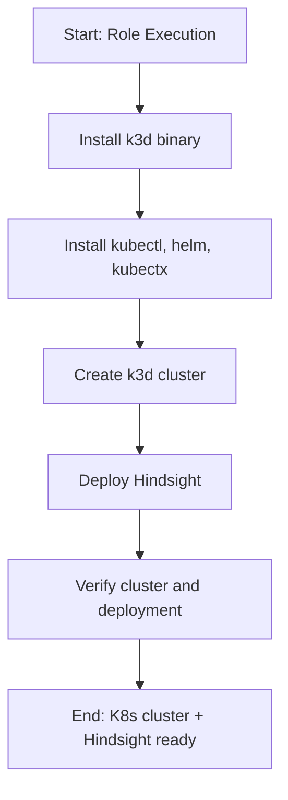

# Role Name: `kubernetes`

## Description

This role sets up a local Kubernetes development cluster using k3d (Kubernetes in Docker) and deploys the Hindsight memory service. It installs k3d, kubectl, helm, and kubectx, creates a k3d cluster with configurable server and worker nodes, then deploys Hindsight as a Kubernetes workload.



## Requirements

- Ansible version: `2.9+`
- Operating System: Arch Linux
- Software: Docker must be installed and running
- Other roles: `docker` (declared as dependency in `meta/main.yml`)

## Role Variables

| Variable | Default Value | Description |
|----------|---------------|-------------|
| `verify_enabled` | `true` | Enable verification tasks |
| `k3d_version` | `latest` | k3d version to install |
| `k3d_cluster_name` | `dev-cluster` | Name of the k3d cluster |
| `k3d_server_nodes` | `1` | Number of server nodes |
| `k3d_worker_nodes` | `0` | Number of worker nodes |
| `k3d_k3s_version` | `""` | Optional k3s version to pin |
| `k3d_port_mapping` | `["80:80", "443:443", "8888:8888@loadbalancer", "9999:9999@loadbalancer"]` | Port mappings for ingress and Hindsight |
| `hindsight_namespace` | `hindsight` | Kubernetes namespace for Hindsight |
| `hindsight_image` | `ghcr.io/vectorize-io/hindsight:latest` | Hindsight container image |
| `hindsight_replicas` | `1` | Number of Hindsight replicas |
| `hindsight_pvc_size` | `10Gi` | PVC size for Hindsight data |
| `hindsight_pvc_storage_class` | `local-path` | Storage class for PVC |
| `hindsight_env_file` | `{{ playbook_dir }}/../.env` | Path to `.env` file for Kubernetes Secret |

## Dependencies

- `docker` - Docker must be installed first (declared in `meta/main.yml`)

## Prerequisites

- `.env` file must exist at the project root with `HINDSIGHT_API_LLM_API_KEY` set
- Ports 8888 and 9999 must be free on the host
- Existing cluster named `dev-cluster` must be deleted before running if port mappings changed:
  ```bash
  k3d cluster delete dev-cluster
  ```

## Further Documentation

- [Getting Started](../docs/kubernetes/getting-started.md)
- [Reference](../docs/kubernetes/reference.md)

## Example Playbook

```yaml
- hosts: localhost
  become: true
  roles:
    - role: docker
    - role: kubernetes
      vars:
        k3d_cluster_name: "my-cluster"
        k3d_server_nodes: 3
        k3d_worker_nodes: 2
```

Or use the main provisioning playbook:

```bash
ansible-playbook provision.yml
```

## License

See LICENSE file in the root of the repository.

## Author Information

Gnome Network Ansible project
