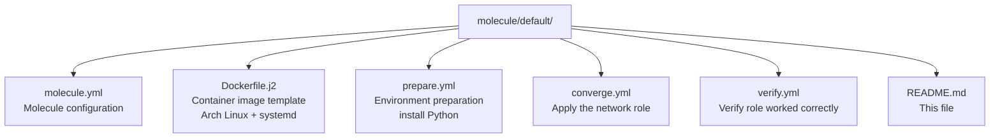

# Molecule Testing for Network Role

This directory contains the Molecule test scenario for the network role, which uses Docker containers to test role functionality in an isolated environment.

## Overview

The network role Molecule tests verify that the role correctly:
- Installs required network packages
- Configures and enables required services (systemd-timesyncd, sshd, NetworkManager)
- Disables conflicting services (systemd-networkd)
- Maintains idempotency (can be run multiple times without changes)

## Test Structure



## Running Tests

### Full Test Sequence

Run the complete test sequence (create, converge, verify, destroy):

```bash
cd roles/network
molecule test
```

### Individual Test Steps

For development and debugging, you can run individual steps:

```bash
# Create test container
molecule create

# Apply the role
molecule converge

# Run verification tests
molecule verify

# Check idempotence (role should not make changes on second run)
molecule idempotence

# Clean up
molecule destroy
```

### Debugging

To login to the test container for manual inspection:

```bash
molecule login
```

## Test Environment

- **Platform**: Docker container based on `archlinux:latest`
- **Init System**: systemd (full systemd support with privileged container)
- **Python**: Python 3.x (installed during prepare phase)
- **Network**: Container has network access for package installation

## What Gets Tested

### Package Installation
Verifies all required network packages are installed:
- ethtool
- wpa_supplicant
- netctl
- dhcpcd
- networkmanager
- ntp

### Service Management
Verifies correct service states:
- **Started and Enabled**: systemd-timesyncd, sshd, NetworkManager
- **Stopped and Disabled**: systemd-networkd

### Idempotency
The role must be idempotent - running it multiple times should not make any changes after the first successful run. Molecule automatically tests this.

## CI/CD Integration

These tests run automatically on GitHub Actions for:
- Pull requests to `main` branch
- Pushes to `main` and `develop` branches

See `.github/workflows/molecule-test.yml` for the workflow configuration.

## Troubleshooting

### Container Creation Issues
- Ensure Docker is running and accessible
- Check that your user is in the `docker` group (Linux)
- On macOS/Windows, ensure Docker Desktop is running

### Package Installation Failures
- The container needs internet access to download packages
- Check if pacman mirrors are accessible
- Consider updating the base image: `docker pull archlinux:latest`

### Service Start Failures
- Some services require specific kernel capabilities
- The container runs in privileged mode to support systemd
- Check container logs: `molecule login` then `journalctl -xe`

### Test Verification Failures
- Review the verify playbook output for specific failures
- Use `molecule login` to inspect the container state manually
- Check service status: `systemctl status <service-name>`

## Extending Tests

To add more verification tests:

1. Edit `verify.yml`
2. Add tasks to check additional role behaviors
3. Use `check_mode: true` with `failed_when: <condition> is changed` to verify state
4. Run `molecule verify` to test your changes

Example verification task:

```yaml
- name: Verify custom configuration file exists
  ansible.builtin.stat:
    path: /etc/myconfig.conf
  register: config_check
  failed_when: not config_check.stat.exists