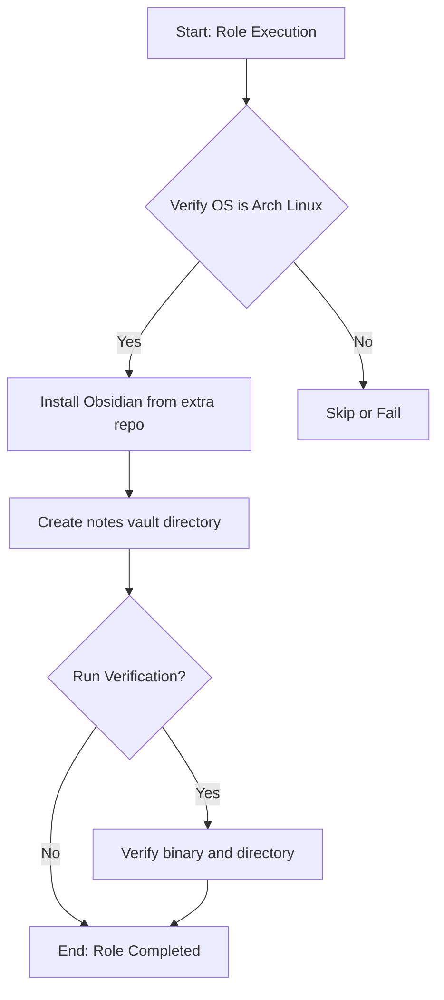

# Role Name: `obsidian`

## Description

Installs and configures Obsidian MD, a powerful knowledge base that works on top of local plain text Markdown files. This role installs Obsidian from the official Arch Linux extra repository and creates a notes vault directory at `~/notes`.



## Requirements

- Ansible version: 2.9+
- Operating System: Arch Linux
- Other roles: None (uses official repo, no AUR dependency)
- Collections: None
- Software: None (Obsidian is in Arch extra repo)

## Role Variables

| Variable               | Default Value | Description                                   |
| ---------------------- | ------------- | --------------------------------------------- |
| `verify_enabled`      | `true`        | Whether to run verification tasks             |
| `obsidian_notes_dir`  | `notes`       | Name of the notes vault directory (created at ~) |

## Dependencies

None.

## Example Playbook

Including an example of how to use the role in a playbook:

```yaml
- hosts: your_target_servers
  become: true
  roles:
    - role: obsidian
      # Optionally override default variables here
      # obsidian_notes_dir: "my-notes"
```

## Verification

This role includes verification tasks that check:
1. Obsidian binary exists at `/usr/bin/obsidian`
2. Notes vault directory exists at `~/notes`

Run verification with:
```bash
ansible-playbook site.yml --tags verify
```

## License

See LICENSE file in the root of the repository.

## Author Information

on3iropolos
