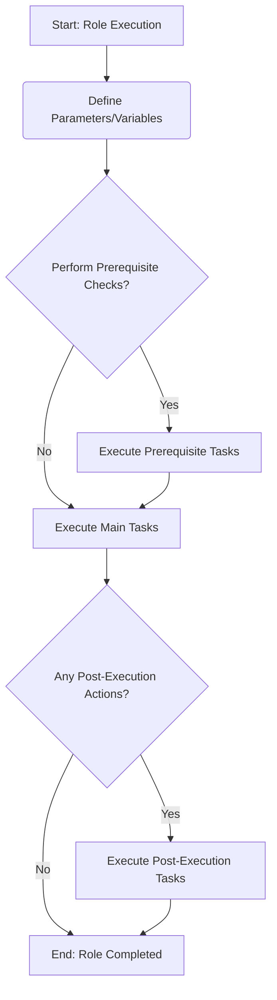

# Role Name: `[ROLE_NAME_HERE]`

## Description

[A brief description of what this role does. What is its purpose? What systems or services does it manage or configure?]

Below is a placeholder for a Mermaid diagram. When creating a new role from this template, replace this with a diagram relevant to the role's functionality. This helps visualize the role's process or architecture.



## Requirements

[List any prerequisites for this role to function correctly.]

-   Ansible version: `[e.g., 2.9+]`
-   Operating System: `[e.g., CentOS 7, Debian 10, Arch Linux]`
-   Other roles: `[e.g., `common`, `security` (if this role depends on them)]`
-   Collections: `[e.g., `community.general` (if specific collections are needed)]`
-   Software: `[e.g., `python3-pip` must be installed on the target host]`

## Role Variables

List of variables that can be set to customize the role's behavior. Variables defined in `defaults/main.yml` should be listed here with their default values.

| Variable                 | Default Value | Description                                                                 |
| ------------------------ | ------------- | --------------------------------------------------------------------------- |
| `role_name_variable_1` | `true`        | Example boolean variable. Controls [feature/behavior].                      |
| `role_name_package_name` | `nginx`       | The name of the package to install.                                         |
| `role_name_config_path`  | `/etc/app/`   | Path to the application configuration directory.                            |
| `role_name_user_list`    | `[]`          | A list of users to create or manage. Each item could be a username or a dict. |

*(For more complex variable structures like lists of dictionaries, provide an example of the expected structure.)*

## Dependencies

A list of other roles (if any) that this role depends on. These roles will be executed before this one.

-   `[dependency_role_name_1]`
-   `[dependency_role_name_2]` (with specific parameters if needed, e.g., `role: dependency_role_name_2, some_param: value`)

*(If no dependencies, state "None".)*

## Example Playbook

Including an example of how to use the role in a playbook:

```yaml
- hosts: your_target_servers
  become: true
  roles:
    - role: [ROLE_NAME_HERE]
      # Optionally override default variables here
      # role_name_variable_1: false
      # role_name_package_name: "apache2"
```

## License

[Specify the license for this role, or state that it falls under the main project license, e.g., "See LICENSE file in the root of the repository." ]

## Author Information

[Your Name or Organization]
[Contact Email or Link to Profile (Optional)]
```
